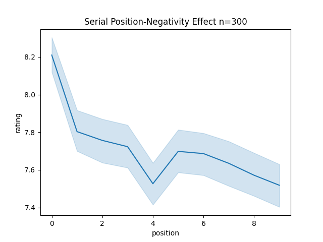

# LLM Serial Position Negativity

I read
[this article](https://suchscience.org/people-encountered-later-in-a-sequence-described-more-negatively/)
about [this study](https://pubmed.ncbi.nlm.nih.gov/38421750/) and thought
it would be interesting to answer this question about LLMs.

Do LLM's rate job applicants more negatively when the applicant is positioned
later in a list containing other applicants?

The answer appears to be yes, although I haven't done a statistical analysis.

